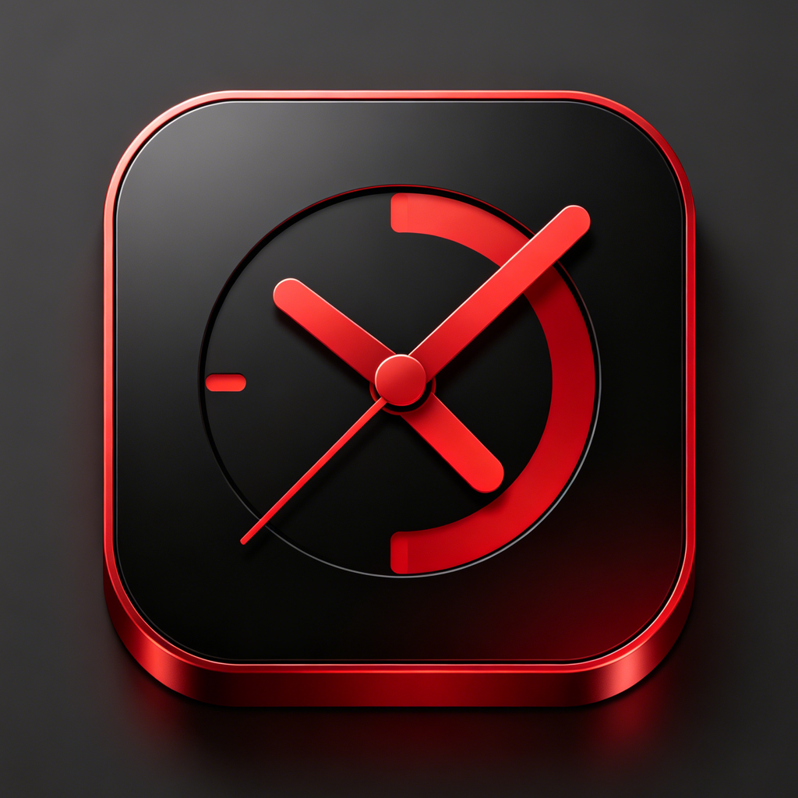
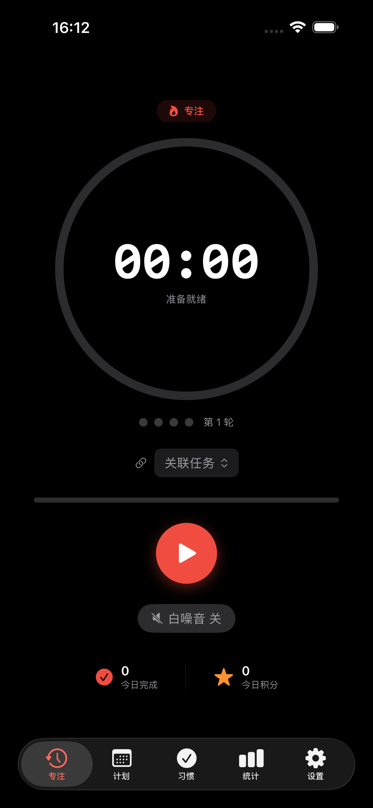
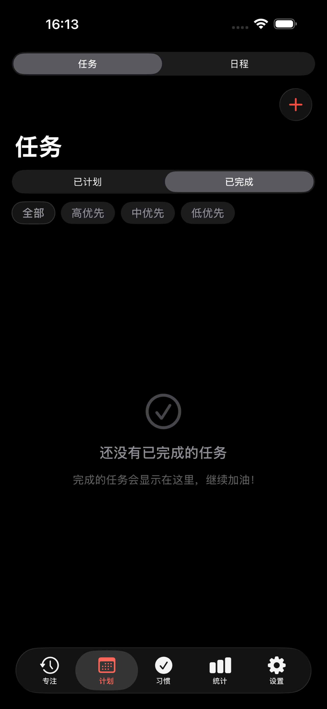
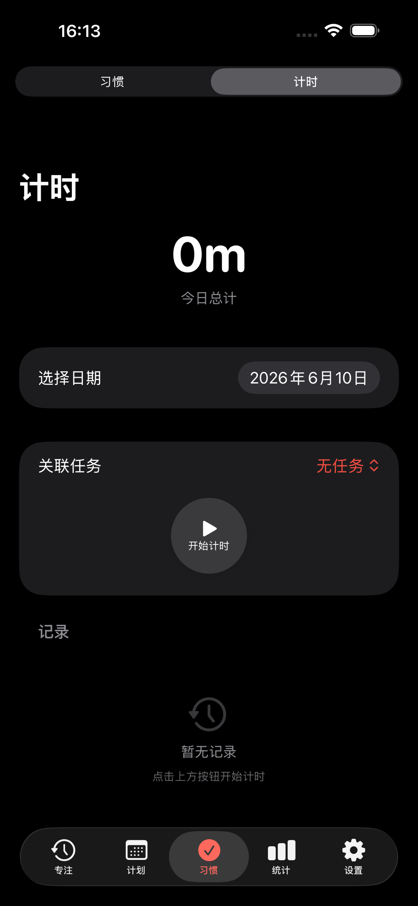
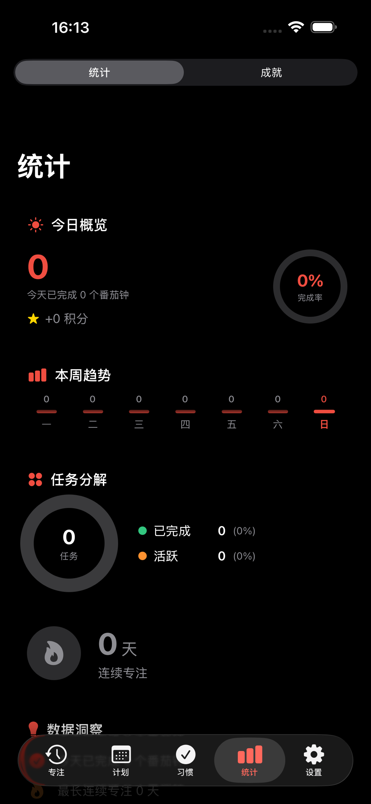
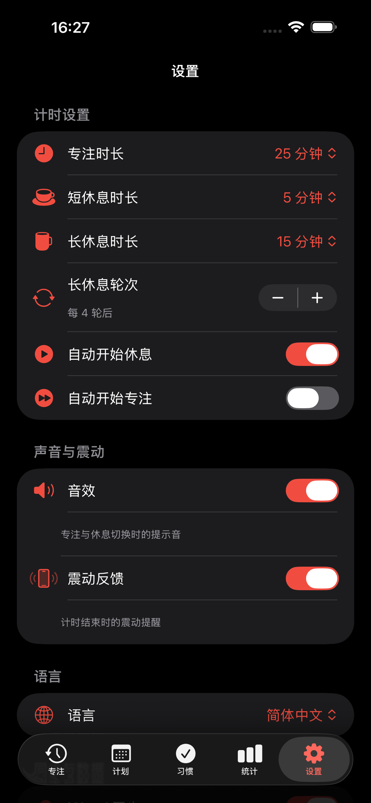

# FlowTakt 流刻

<p align="center">
  
</p>

<p align="center">
  <strong>专注、计划、习惯，一气呵成。</strong><br/>
  一款融合番茄钟、任务管理、习惯追踪与自由计时的 iOS 效率工具。
</p>

<p align="center">
  <a href="https://apps.apple.com/app/flowtakt/id6778738267"></a>
  &nbsp;
  
  
  
</p>

---

## 截图

<p align="center">
  
  
  
  
  
</p>

---

## 功能

### 🍅 番茄钟专注
- 标准番茄工作法（25 分钟专注 / 5 分钟短休息 / 15 分钟长休息）
- 全自定义时长配置，可绑定具体任务
- 程序合成白噪音，无需额外音频文件
- 后台计时 + 推送通知，锁屏也能追踪进度

### 📋 任务管理
- 创建、编辑、归档任务，支持子任务拆分
- 按优先级 / 状态 / 日期筛选，搜索
- 预估番茄数 vs 实际完成数，任务耗时一目了然
- 支持重复任务（每日 / 每周 / 自定义规则）

### 📅 日历日程
- 内置日程事件管理，可关联任务
- 全天事件 / 时间段事件，农历日期显示

### ✅ 习惯追踪
- 自定义习惯（每日 / 每周 / 每月目标）
- 连续打卡天数追踪，历史记录
- 最长连续记录激励

### ⏱️ 自由计时器
- 独立计时器，可绑定任务 / 项目 / 标签
- 按日期查看所有计时记录
- 支持计费标记（适合自由职业者）

### 📊 统计分析
- 今日概览卡片：专注时长、完成任务数、习惯打卡
- 周趋势 / 月趋势图表
- 任务时间分布，效率洞察

### 🏆 成就系统
- 10 个预定义成就（专注数量、连续天数、累计积分）
- 完成番茄钟获取积分，中断扣除积分
- 成就解锁动画

### 🌐 其他
- 中英双语，运行时切换无需重启
- iCloud 多设备同步
- 专注模式（屏蔽通知干扰）
- 触觉反馈，多种提示音
- 深色模式适配

---

## 技术栈

| 类别 | 技术 |
|------|------|
| UI | SwiftUI |
| 数据持久化 | CoreData + NSPersistentCloudKitContainer |
| 同步 | CloudKit (iCloud) |
| 响应式 | Combine |
| 音频 | AVFoundation (实时合成白噪音) |
| 通知 | UserNotifications |
| 本地化 | 运行时双语 (zh-Hans / en) |
| 最低系统 | iOS 16.0 |
| 第三方依赖 | **零** — 纯原生实现 |

---

## 架构

```
┌─────────────────────────────────┐
│          SwiftUI Views           │  界面层
├─────────────────────────────────┤
│          ViewModels              │  状态管理 (ObservableObject)
├─────────────────────────────────┤
│          Services                │  业务逻辑 (协议 + 实现)
│  TimerManager / FocusService /   │
│  TaskService / HabitService …   │
├─────────────────────────────────┤
│     PersistenceController        │  CoreData + CloudKit
└─────────────────────────────────┘
```

采用 **MVVM + Service Layer + Dependency Injection** 架构：
- `AppDependency` 作为 DI 容器统一管理所有依赖
- Service 层通过协议定义接口，支持测试替换
- ViewModel 通过 `@EnvironmentObject` 注入各视图

---

## 构建与运行

### 前提条件
- macOS + Xcode 16+
- Apple Developer 账号（用于 iCloud / 推送通知功能）

### 步骤

```bash
git clone https://github.com/jerrynxk/FlowTakt.git
cd FlowTakt
open FlowTakt.xcodeproj
```

1. 在 Xcode 中打开项目
2. 选择 **FlowTakt** scheme，目标设备为你的 iPhone 或模拟器
3. 在 Signing & Capabilities 中选择你的 Team
4. 如有需要，修改 Bundle Identifier（默认 `com.flowtakt.FlowTakt`）
5. ⌘R 运行

> **注意**：iCloud 同步和推送通知需要付费 Apple Developer 账号。如仅使用模拟器调试，这些功能会自动降级为本地模式。

---

## 项目结构

```
FlowTakt/
├── App/                    # 入口 + DI 容器
│   ├── FlowTaktApp.swift
│   └── AppDependency.swift
├── Data/                   # CoreData 模型 + 扩展
│   ├── PersistenceController.swift
│   ├── FlowTakt.xcdatamodeld/
│   ├── Entities/
│   └── Extensions/
├── Services/               # 业务服务层 (11 个 Service)
├── ViewModels/             # 视图模型层 (8 个 ViewModel)
├── Views/                  # SwiftUI 视图
│   ├── Focus/              # 番茄钟
│   ├── Task/               # 任务
│   ├── Stats/              # 统计
│   ├── Achievements/       # 成就
│   ├── Settings/           # 设置
│   └── ...                 # 习惯 / 日历 / 计时器
├── Extensions/             # Swift 扩展
└── Utils/                  # 常量 / 本地化 / 触觉
```

---

## License

本项目采用 [MIT License](LICENSE) 开源。你可以自由使用、修改、分发，包括商业用途。

---

## 联系

- App Store: [FlowTakt 流刻](https://apps.apple.com/app/flowtakt/id6778738267)
- 反馈与建议: dlyzh_0303@qq.com
